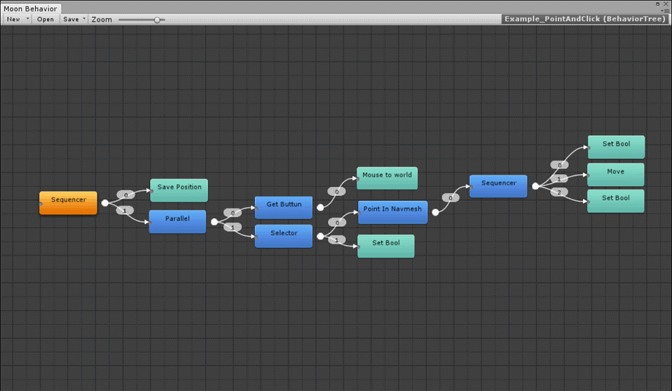

### Creating BehaviorTree Asset

To Create a new Behavior tree asset, Open the Behvaior editor located on "Window/MoonBehavior/Editor"

-Click on "New" then select "BehaviorTree"

A window will display, put the name and hit "Ok".

### Adding nodes 

Right click > "Add node" to display the node list

To add it simply click on the item

>**Search filter:** You can Search by name or by category (the blue label)

### Moving nodes 

You can move nodes holding left click ..

Recursive move holding Shift + left click.

### Multi Selection

You can multi select nodes to move or delete just click and drag the mouse on a empty point inside the grid

### Connecting nodes

To connect a node to other just click on the output of source node and click the target node to connect it.
> Right click on a empty point on the canvas to clear the source output.

> Right click on  a node input to clear the connection

