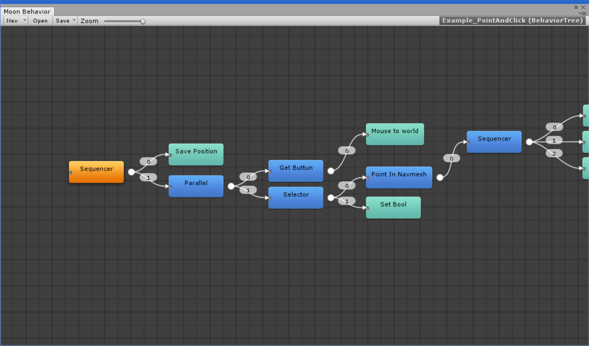

# Welcome

MoonBehavior is a [BehaviorTree](https://en.wikipedia.org/wiki/Behavior_tree_(artificial_intelligence,_robotics_and_control)) solution for the [Unity](https://www.unity3d.com) game engine. That enables you to make beliveable AI agents and game logic.

### Main Features

#### Nice visual editor
Node based editor inspired in unity's mecanim window easy to use for making your AI's faster !
#### Blackboard Memory
Allows you share information between your Behavior Trees and your AI
#### Perception
Add field of view and detect your players with the Perception component !
#### Realtime Debugger 
Allows you to debug and view your behavior trees execution during playmode trought the Node editor.
#### Unity friendly
Everything is saved as a single Scriptable Object asset that makes your nodes and your BT's friendly with unity's serialization system.

